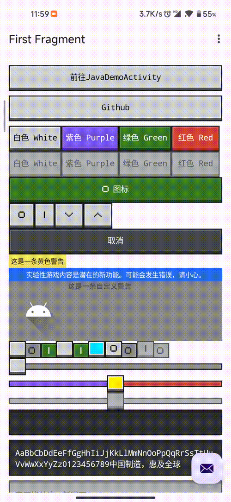

<p align="center">
  
</p>

<p align="center">
  
  
  
</p>

---

## 📖 介绍

纯 **Kotlin** 继承 `View` 和 `AppCompatView` 实现，**基本兼容 Java**，**无 xml** 等其他资源。

* 根据 OreUI 标准和实际游戏效果实现
* 使用令人忍俊不禁的 `StyleSheet` 类管理样式
* 使用令人忍俊不禁的 `Pixels2D` 类管理像素图
* 对原仓库进行一些自用修改
---

## 🚀 使用

你可以通过以下链接获取 Demo 和编译好的库文件：
👉 **[Releases](https://github.com/1503Dev/ore-ui-for-android/releases)**

### 导入说明
由于项目不依赖外部资源，你可以根据需求选择导入 `jar` 或 `aar`。
> [!IMPORTANT]
> 项目运行需要导入 **AppCompat** 库，否则将导致无法运行。

### 前置配置
建议在 View 渲染之前初始化显示基准以通过 dp 计算代替 px，达到最佳效果。
```kotlin
OreUI.initDisplayBaseline(context)
```

### 示例代码
* [Kotlin 示例](./app/src/main/java/dev1503/oreuiforandroid/FirstFragment.kt)
* [Java 示例](./app/src/main/java/dev1503/oreuiforandroid/JavaDemoActivity.java)

---

## ⚖️ 开放源代码许可

* **OreUI for Android** 根据 [Apache License 2.0](./LICENSE) 授权
* [AndroidX AppCompat](https://developer.android.com/jetpack/androidx/releases/appcompat) 根据 Apache License 2.0 授权

---

## ⚠️ 说明

* `1503Dev/ore-ui-for-android` **并非** Minecraft 官方作品。
* `1503Dev` 与 Mojang Studios 和 Microsoft **无从属关系**。
* 设计和样式最终解释权属于 **Mojang Studios** 和 **Microsoft**。
---

## 🎨 画廊
> `v0.3.0.3.202604121153-beta`


